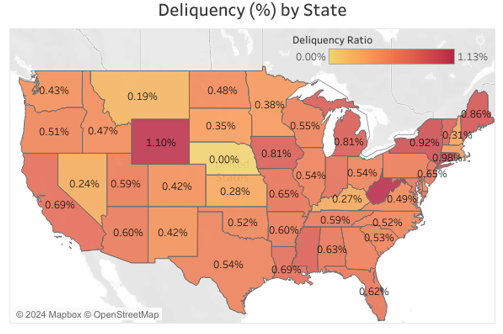
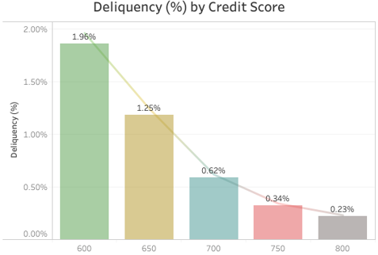
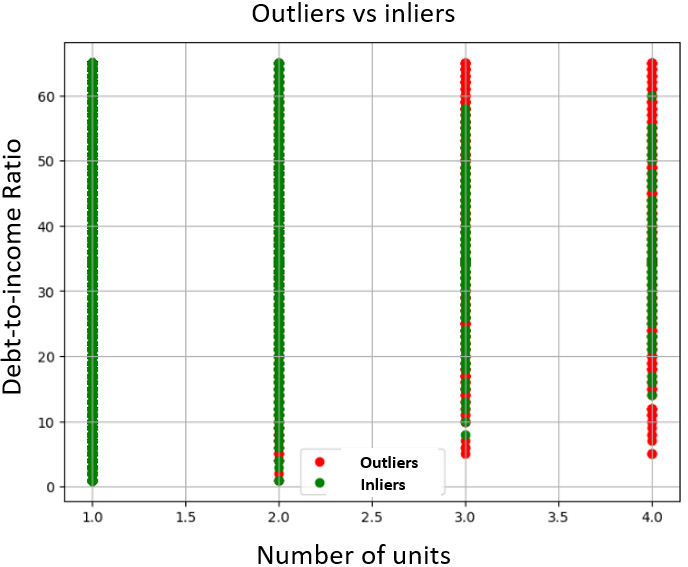
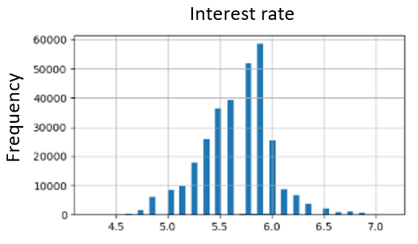
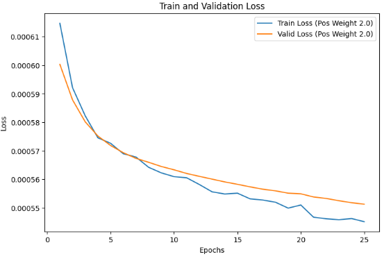

# Research Fellow 

### Technical Skills
Python, SQL, Azure, Machine Learning, Deep Learning

### Education
**Ph.D. Mechanical and Mechatronics Engineering**  
University of Waterloo, Waterloo, ON, Canada
 09/2018 - 09/2023   
**M.S. Aeronautics & Astronautics Engineering**  
Purdue University, West Lafayette, IN, USA
 08/2015 - 12/2017   
 **Relevant coursework:** Statistical Methods, Applied Regression Analysis, Design of Experiments, Computational Methods, Linear Algebra Applications, Advanced Mathematics for Engineers and Physicists I, Vector Calculus   
**B.Sc. Textile Engineering**  
National Textile University, Faisalabad, Pakistan 
 01/2004 - 01/2008   

### Certifications 
-  **Coursera Deep Learning Specialization**  
  Courses: Neural Networks & Deep Learning, Structuring Machine Learning Projects, Convolutional Neural Networks, Improving Deep Neural Networks, Sequence Models   
-  **Microsoft Azure Data Scientist Associate Certification**

### Project 1 - Predict Mortgage Defaults Using Freddie Mac Datasets.
[Details and code available here](https://github.com/khizarrouf/End_to_End_Mortgage_Default_Project)
-  Developed a classification model to predict whether a home loan will default or not.  
-  Gathered large data sets from the Freddie Mac website and visualized in Tableau. 
-  Preprocessed the data in Azure ML using Python libraries. Performed outlier detection with a scalable unsupervised outlier detection framework. The data was stratified to ensure representative coverage across all states. 
-  Trained a neural network to minimize false negatives and maximize ROC AUC. The model’s performance was tracked with MLflow. The penalty functions were applied to address class imbalance. A custom batch sampler class was implemented to further refine the model's training process. 
-  Performed SHAP to identify important features and their contributions. 
-  Deployed the model locally via FastAPI for inference. 

  

  

  

  

  

  

  

### Project 2 - Predict Effective Properties of Materials Based on Microstructure and Constituent Properties.
-  Developed a supervised regression model to predict the effective properties of a material based on its microstructure and constituent properties. 
-  Automated dataset generation in simulation software by developing and implementing Python scripts. 
-  Identified and removed outliers using the standard deviation method and normalized the data to scale features for better model performance.  
-  Trained and validated Artificial Neural Network (ANN) and XGBoost models to predict the effective properties of the material. 
-  The trained model significantly reduced the inference time compared to the conventional modeling approach, while maintaining the same level of accuracy. 

  

  

  

### Project 3 - Development of a Convolutional Neural Network for Defect Detection.
-  Developed a convolutional neural network (CNN) to automate defect detection and quantification in material samples. 
-  Gathered experimental data by capturing images with cameras during testing. 
-  Preprocessed large image datasets using Pillow Python library to enhance image quality and consistency, including resizing, normalization, and augmentation techniques, ensuring a robust dataset for training the defect detection model. 
-  Utilized CVAT AI to annotate images with high accuracy, applying bounding boxes to create a labeled dataset, enabling the convolutional neural network (CNN) to effectively learn defect patterns. 
-  Trained a CNN model using the U-Net architecture, optimizing it for material defect detection. 

  

  

  

###  Project 4 - Development of a AI-Driven Tax Filing with OCR and RAG. 
-  Develop an AI-powered tax filing system for small businesses on Microsoft Azure AI. 
-  Implement a hybrid LLM solution with NLP and RAG to extract insights from structured and unstructured CRA documents. 
-  Integrate OCR for receipt extraction, automate ledger and tax filing, and apply NLP and RAG for document processing. 
-  Measure system performance, accuracy, and efficiency in automating tax filing tasks. 
